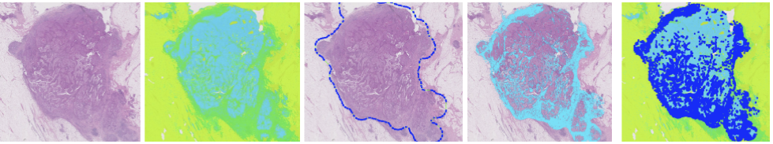

# Pathology Tiger Baseline

This repository contains the code for the TIGER challenge baseline algorithm.

## Weights for Faster-rcnn and Hooknet
https://surfdrive.surf.nl/files/index.php/s/TAJY8FEFWsLgHj8

# Acknowledgement

This code is made by Cyril de Kock
